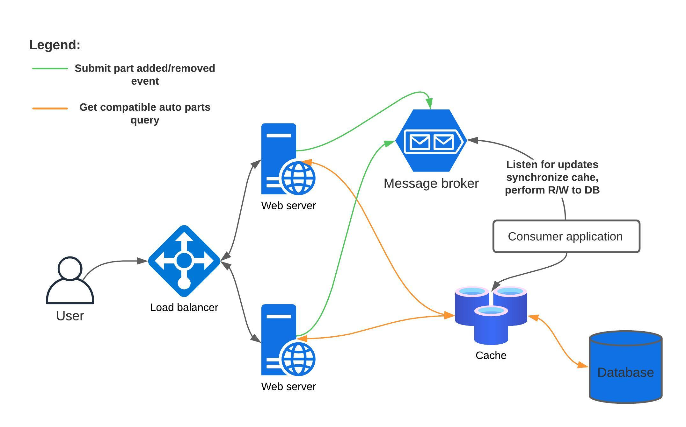

## Auto parts compatibility storage

### Requirements
- **Context**
    - Model a data storage of the compatibility of parts
- **Functional requirements**
    - Support part item additions and deletions 
- **Non-functional requirements**
    - System should be able to store tens of millions of records.
    - System should be able to withstand frequent INSERT and DELETE operations.

### Database
- No-SQL database **Apache Cassandra**
    - Reasons
        - Allows to horizontally scale the number of records stored by adding nodes to the cluster with no downtime
        - Due to a concept of hash ring, allows to efficiently locate the node, responsible for handing 
        a particular record, which yields low-latency of DML queries

### Data model definition
- **Schema**
    - Table 1: **AUTO_PARTS**
        - Description
            - Stores detailed information regarding available automobile parts.
        - Columns
      
          | Column Name   | Column Type | PK |
          |---------------|-------------|----|
          | serial_number | string      | PK |
          | name          | string      |
          | manufacturer  | string      |
          | weight        | boolean     |

    - Table 2: **AUTO_PARTS_COMPATIBILITIES**
        - Description
            - Stores parts serial numbers, which the given part is compatible with.
       - Columns

         | Column Name     | Column Type | PK |
         |-----------------|-------------|----|
         | serial_number   | string      | PK |
         | compatible_with | string      |

## High-level design

